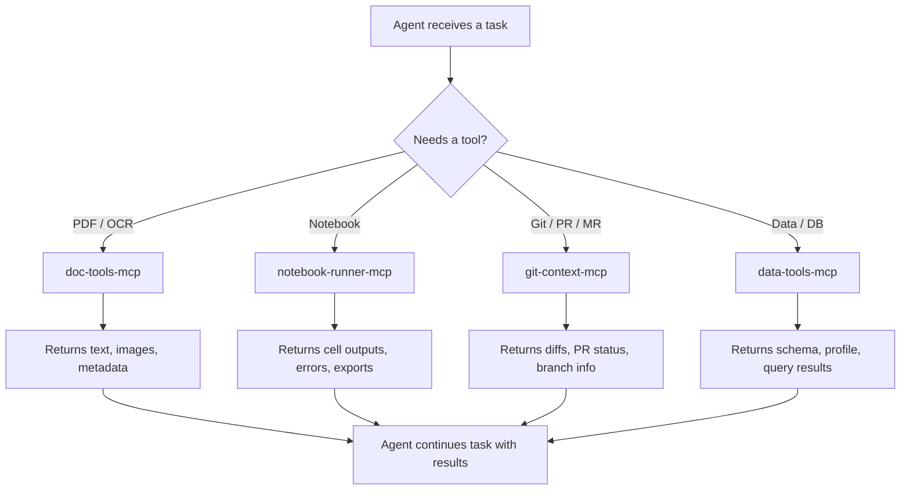

# agent-mcps

MCP servers that give AI agents callable tools for document processing, Jupyter
notebooks, Git/GitHub/GitLab, and data inspection. Install one, install all —
each is an independent package on PyPI.

> **Related:** [agent-skills](https://github.com/Sakethv7/agent-skills) — workflow
> skills for Claude Code that use these MCPs under the hood.

---

## How it works



Unlike skills (which guide an agent through a workflow), MCPs expose raw tools the
agent calls **mid-task** — no explicit invocation needed. The agent decides when to
reach for a tool based on context.

---

## Packages

| Package | PyPI | Install | What it does |
|---|---|---|---|
| `doc-tools` | `doc-tools-mcp` | `uvx doc-tools-mcp` | PDF text extraction + OCR |
| `notebook-runner` | `notebook-runner-mcp` | `uvx notebook-runner-mcp` | Jupyter notebook execution + editing |
| `git-context` | `git-context-mcp` | `uvx git-context-mcp` | Git ops + GitHub PRs + GitLab MRs |
| `data-tools` | `data-tools-mcp` | `uvx data-tools-mcp` | Data file profiling + DB schema inspection |

---

## Quick start

### 1. Add to Claude Code (`~/.claude/settings.json`)

```json
{
  "mcpServers": {
    "doc-tools":       { "command": "uvx", "args": ["doc-tools-mcp"] },
    "notebook-runner": { "command": "uvx", "args": ["notebook-runner-mcp"] },
    "git-context":     { "command": "uvx", "args": ["git-context-mcp"] },
    "data-tools":      { "command": "uvx", "args": ["data-tools-mcp"] }
  }
}
```

### 2. Add to Claude Desktop (`~/Library/Application Support/Claude/claude_desktop_config.json`)

Same JSON, same keys.

### 3. Use with any MCP-compatible agent

Each server speaks the standard MCP protocol over stdio. Point your agent's MCP
client at `uvx <package-name>` or `python -m <module>.server`.

---

## Tools at a glance

### doc-tools-mcp

```
pdf_info            → page count, title, author, encryption status
detect_text_layer   → check if PDF has a usable text layer (call this first)
extract_text        → pull text from native text layer (fast)
ocr_pages           → OCR a page range via pdftoppm + tesseract (for true scans)
rasterize_pages     → convert pages to base64 JPEG images
extract_toc         → parse table of contents with OCR fallback
```

**Decision flow:**
```
pdf_info → detect_text_layer
               ├── has_text_layer: true  → extract_text   (fast, accurate)
               └── has_text_layer: false → ocr_pages      (slower, for scans)
                                           rasterize_pages (if images needed)
```

**System deps:** `brew install poppler tesseract` / `apt-get install poppler-utils tesseract-ocr`

---

### notebook-runner-mcp

```
get_notebook_info   → kernel, language, cell counts, error summary
list_cells          → all cells with type, execution count, preview
get_cell            → full source + outputs for one cell
get_errors          → all cells with error outputs
run_cell            → execute one cell, get output
run_all             → execute all cells in order
run_range           → execute cells start..end
insert_cell         → insert code or markdown cell at index
update_cell         → replace cell source (clears outputs)
delete_cell         → remove a cell
clear_outputs       → clear one cell or all cells
get_variables       → inspect current variable state (name, type, shape)
export_to_script    → convert notebook to .py file
```

**Typical flow:**
```
get_notebook_info → list_cells → get_cell (inspect) → run_cell (execute)
                                                     → get_errors (debug)
                                                     → get_variables (inspect state)
```

---

### git-context-mcp

```
── Local git ──────────────────────────────────────────────
git_status          → branch, staged, unstaged, untracked, commits ahead
git_log             → commit history (filterable by author, file)
git_diff            → diffs between refs, staged changes, file-level stats
git_blame           → per-line blame with author and commit summary

── Branch management ──────────────────────────────────────
list_branches       → local + remote branches with last commit
create_branch       → new branch from optional base ref
checkout            → switch to branch, tag, or commit
stash               → push / pop / list / drop stash

── GitHub PRs (requires gh CLI) ───────────────────────────
pr_list             → open/closed/merged PRs
pr_view             → full PR details, review state, CI status
pr_diff             → PR diff or stat summary
pr_create           → open a PR from current branch
pr_comment          → add a comment
pr_merge            → merge (squash / merge / rebase)
pr_checks           → CI check statuses

── GitLab MRs (requires glab CLI) ─────────────────────────
mr_list             → open/closed/merged MRs
mr_view             → MR details
mr_create           → open an MR
```

**Typical code review flow:**
```
git_status → pr_list → pr_view → pr_diff → pr_checks
                                          → pr_comment (leave feedback)
                                          → pr_merge   (when ready)
```

---

### data-tools-mcp

```
── File tools ─────────────────────────────────────────────
profile_file         → full profile: shape, nulls, distributions, outliers,
                       quality issues, sample rows. Works on CSV/Excel/Parquet/JSON/TSV
list_sheets          → Excel sheet names with row/column counts
sample_file          → first N rows from any file
find_column_in_file  → search columns by name pattern
compare_schemas      → diff two files' column sets and types

── Database tools (SQLAlchemy) ────────────────────────────
list_tables          → all tables in a database
describe_table       → columns, types, PKs, FKs, indexes, row count
sample_rows          → first N rows from a table (with optional WHERE)
find_column          → search all tables for a column by name pattern
run_query            → execute a SELECT query (read-only, auto-LIMIT)
```

**Supports:** PostgreSQL, SQLite, MySQL (any SQLAlchemy-compatible database)

**Typical data investigation flow:**
```
profile_file → find_column_in_file → sample_file
list_tables  → find_column         → describe_table → sample_rows → run_query
```

---

## System dependencies

| MCP | Required |
|---|---|
| doc-tools | `poppler-utils`, `tesseract-ocr` |
| notebook-runner | `jupyter` kernel for the target language |
| git-context | `git` (always), `gh` (GitHub), `glab` (GitLab) |
| data-tools | none beyond pip deps |

---

## Development

```bash
git clone https://github.com/Sakethv7/agent-mcps
cd agent-mcps
uv sync --all-packages        # install all packages in editable mode

# Run a specific server locally
uv run python -m doc_tools.server
uv run python -m notebook_runner.server
uv run python -m git_context.server
uv run python -m data_tools.server
```

---

## Publishing

Tag a release to publish a single package to PyPI:

```bash
# Bump version in doc-tools/pyproject.toml first, then:
git tag doc-tools-v0.2.0
git push origin doc-tools-v0.2.0
# GitHub Actions publishes only doc-tools-mcp to PyPI
```

Uses [PyPI trusted publishing](https://docs.pypi.org/trusted-publishers/) — no
API key needed, configure once in your PyPI project settings.

---

## Relation to agent-skills

[agent-skills](https://github.com/Sakethv7/agent-skills) contains guided workflow
skills (markdown) that walk an agent through multi-step document tasks with user
confirmation. These MCPs provide the raw tools those workflows use.

**Skills** = guided workflow with user gates.
**MCPs** = callable tools for any task, any time.

They're designed to be used together but work independently.
